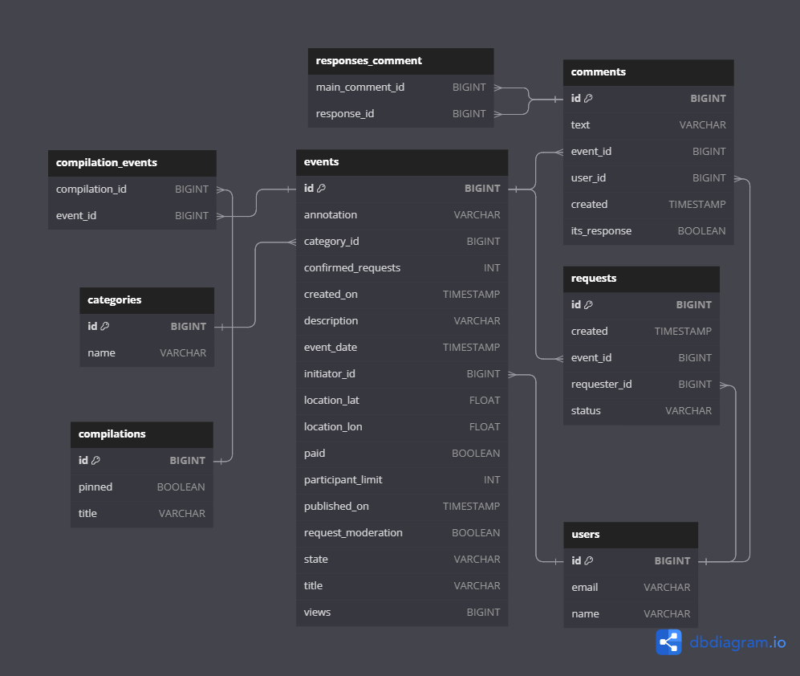

    Дипломный проект по курсу Яндекс Практикума "Java-разработчик". 

    *Ссылка на pull request для моего дорогого ревьюера: https://github.com/CheTigor/java-explore-with-me/pull/3

    Данный проект представляет собой удобную афишу, которая поможет пользователям публиковать интересные события и
находить компанию для их посещения.

    Проект разделен на два модуля: основной сервис и сервис статистики, каждый модуль имеет свою базу данных. Такой
подход позволяет более гибко управлять проектом, при необходимости его масштабировать, тем самым обеспечив более высокую
скорость работы.

    Основной сервис предоставляет возможность поиска мероприятий по различным критериям – дате, месту проведения, 
категории и т.д. Также пользователи могут создавать свои собственные мероприятия и приглашать друзей для их посещения.
Для этого используется механизм реквестов - пользователь отправляет запрос на участие и в зависимости от конфигурации
самого мероприятия оно либо модерируется, либо сразу подтверждается. Сервис разделен на 3 слоя: публичный, приватный и 
административный. Каждый имеет свою зону винидости объектов и разные эндпоинты взаимодействия с ними. Так же есть 
возможность оставлять комментарии под каждым мероприятием, что ценно для пользователя для оценки события.
    Сервис статистики позволяет анализировать данные о посещениях конкретных эндпоинтов и определять популярность 
различных событий. Это помогает, например, адаптироваться к потребностям пользователей.
    Для реализации проекта мы использовали такие технологии:
1) Docker помог имитировать реальную работу сервиса;
2) Spring облегчает работу программиста по написанию веб-приложений, что делает код простым и читаемым;
3) Библиотека QueryDSL помогает составлять сложные запросы поиска, которые в будущем очень просто модифицировать, не
переписывая весь запрос целиком;
4) База данных использовалась PosgreSQL;
5) Библиотека Lombok помогает проводить валидацию данных и пишет часть кода за разработчика, что экономит его время и,
опять же, код становиться более читаемым.

ER диаграмма базы данных:

Ссылка на ER диаграмму базы данных программы: https://dbdiagram.io/d/Explore-with-me-6527184affbf5169f0841f7d

